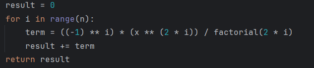
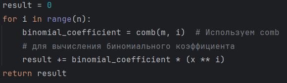
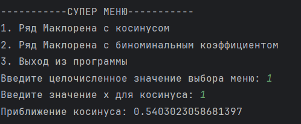
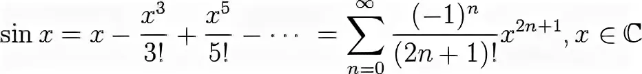
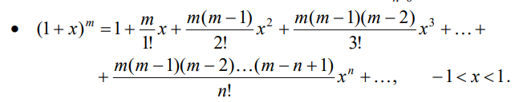

# 📚 Проект: Вычисление ряда Маклорена

Этот проект представляет собой программу для вычисления ряда Маклорена с использованием **косинуса** и **биномиальных коэффициентов**. Программа имеет удобное меню для выбора действий.

---

## 🚀 Как запустить проект:

1. Убедитесь, что у вас установлен **Python 3.6 или выше**.
2. Склонируйте репозиторий:
   ```bash
   git clone https://github.com/ваш-проект.git
3. Перейдите в папку с проектом:
   ```bash
   cd ваш-проект
4. Запустите файл программы:
   ```bash
   python practice5.py

---

## 📋 Возможности

- **Чек-лист возможностей**:
  - [x] Вычисление косинуса через ряд Маклорена
  - [x] Вычисление (1 + х)^m через ряд Маклорена
  - [ ] Обработка исключений для ввода данных
  - [ ] Расширенная документация для пользователей

---

## 🛠 Функции программы:
## Главное меню:
### Программа предоставляет следующее меню:

---

1. Вычисление ряда Маклорена для косинуса.
2. Вычисление ряда Маклорена с биномиальным коэффициентом.
3. Выход из программы.

## Коды для рядов Маклорена:

---

### Пример кода для косинуса:



### Пример кода для (1 + x)^m:



## Примеры использования кодов для рядов Маклорена:

---

### Пример использования кода для косинуса:



### Пример кода для (1 + x)^m:


---

### Формулы для программы

## Формула для косинуса:



## Формула для (1 + x)^m:



---

**Автор:** *Кирилл*